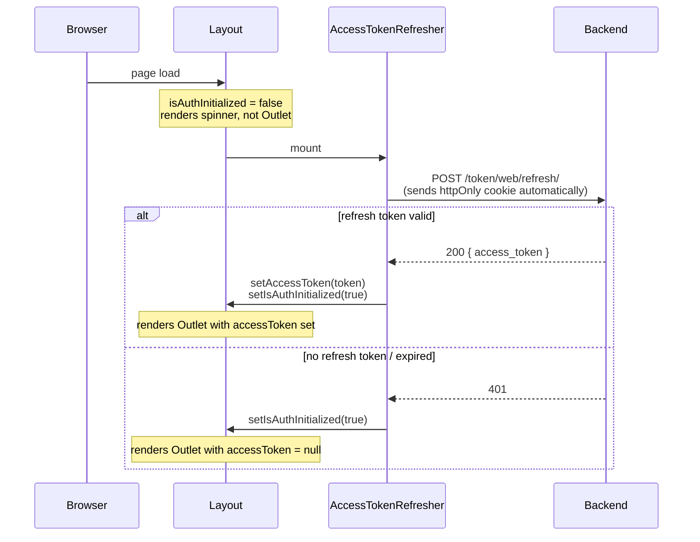
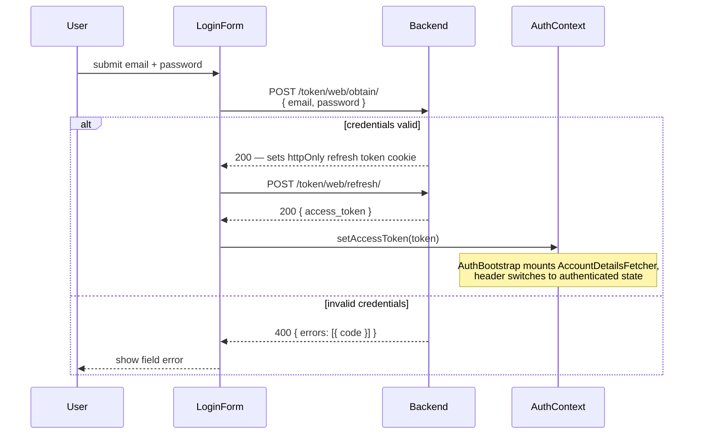
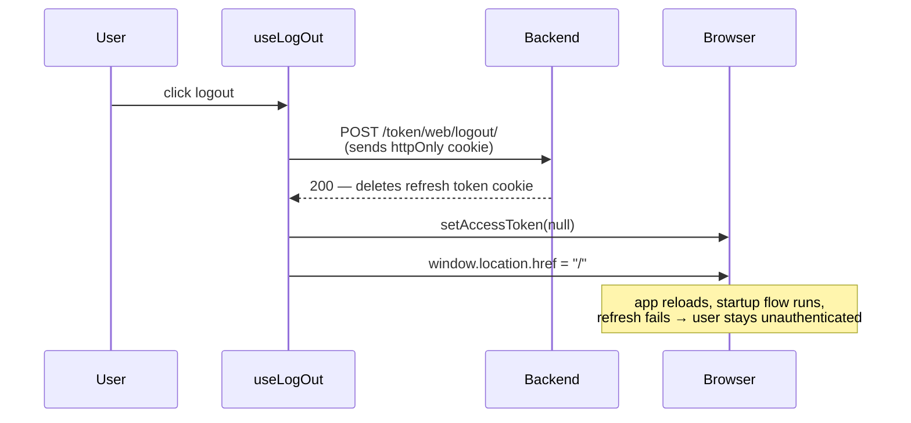
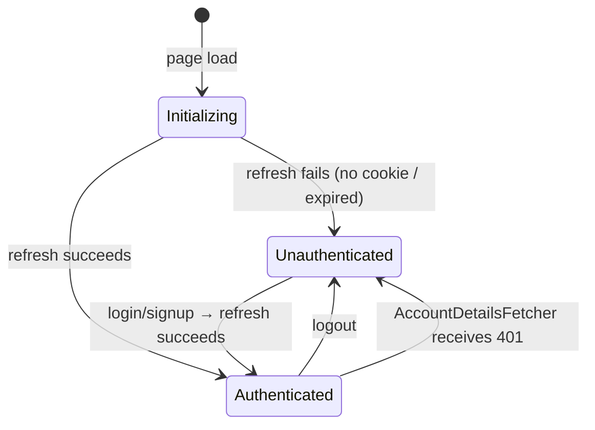

# Authentication (web)

> This document covers the authentication flow for the **web frontend** only.
> The mobile app uses different token delivery mechanisms (no httpOnly cookies).

## Overview

The web frontend uses a **two-token** scheme:

| Token | Where stored | Accessible to JS | Lifetime |
|---|---|---|---|
| **Access token** | React context (in-memory) | Yes — passed as `Authorization: Bearer …` header | 24 hours |
| **Refresh token** | httpOnly cookie | No | 30 days |

Keeping the access token in memory (not localStorage) limits XSS exposure. Keeping the refresh token in an HTTP-only cookie prevents it from being read by any script.

---

## Auth state

`AuthContext` is the single source of truth for auth state:

```
accessToken: string | null   — null until refreshed or obtained via login
isAuthInitialized: boolean   — false until the startup token refresh completes
```

`isAuthInitialized` exists solely to distinguish "we haven't checked yet" from "we checked and the user is unauthenticated". Without it, components would briefly render as unauthenticated on every page load, even for logged-in users.

---

## Flows

### 1. App startup

Every time the app loads, `AuthBootstrap` (rendered by `Layout`) kicks off a token refresh. `Layout` withholds `<Outlet />` until that check is complete to avoid a content flash.



Once `isAuthInitialized` is true, `AuthBootstrap` also mounts `AccountDetailsFetcher` (if a token was obtained), which fetches `/accounts/me/` and stores the result in `AccountContext` and `localStorage`.

---

### 2. Login

After the login API sets the httpOnly cookie, the frontend immediately calls the refresh endpoint to obtain an access token and sets it in context. No page reload is needed.



A "Login as demo" button hits `/token/web/obtain-demo/` instead, which requires no credentials. The rest of the flow is identical.

---

### 3. Logout



There is no server-side token blacklisting. Because tokens last 24 hours and the access token is only ever in memory, a logged-out user's token is gone as soon as the page unloads.

---

### 4. Auth state machine



---

## Component map

```
AuthContextProvider          — holds accessToken, isAuthInitialized
└── Layout
    ├── AuthBootstrap
    │   ├── AccessTokenRefresher   (while !isAuthInitialized)
    │   └── AccountDetailsFetcher  (once authenticated)
    └── <Outlet />                 (gated on isAuthInitialized)
        ├── HomePage
        ├── PinCreationToolPage    (redirects to / if !accessToken)
        └── … other pages
```

---

## Key files

| File | Role |
|---|---|
| `src/contexts/authContext.tsx` | `AuthContext` — `accessToken`, `isAuthInitialized` |
| `src/components/AuthBootstrap/AuthBootstrap.tsx` | Orchestrates startup: refresh then account fetch |
| `src/components/AuthBootstrap/AccessTokenRefresher.tsx` | Calls refresh endpoint, sets `isAuthInitialized` |
| `src/components/AuthBootstrap/AccountDetailsFetcher.tsx` | Fetches `/accounts/me/`, populates `AccountContext` |
| `src/lib/hooks/useLogIn.ts` | Calls refresh endpoint after login/signup, sets access token |
| `src/lib/hooks/useLogOut.ts` | Calls logout endpoint, clears token, redirects |
| `src/components/LoginForm/LoginFormContainer.tsx` | Login form — calls `useLogIn` on success |
| `src/pages/Layout.tsx` | Gates `<Outlet />` on `isAuthInitialized` |
