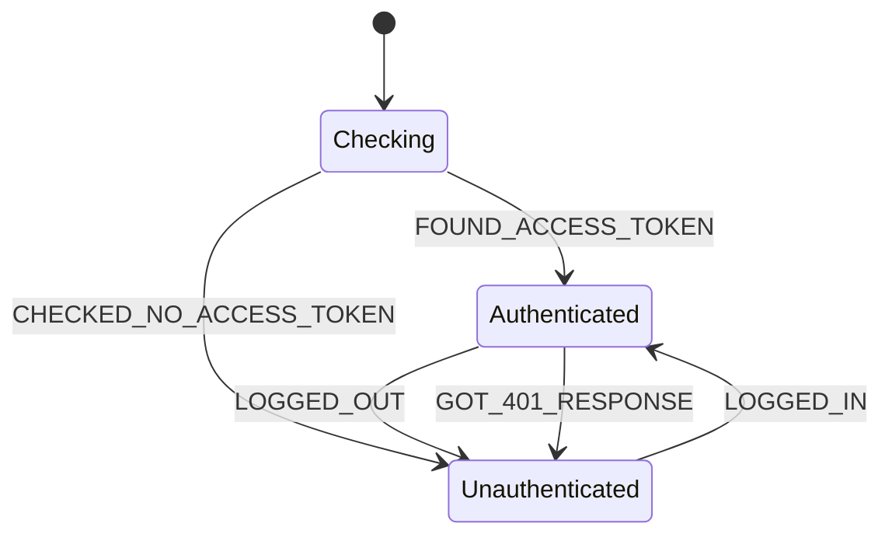
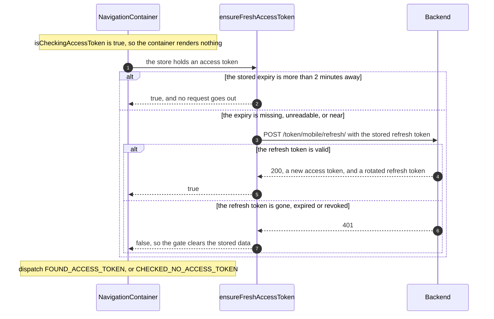
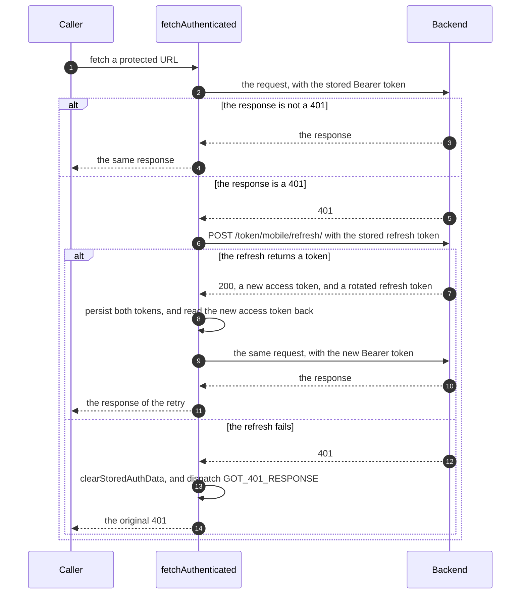
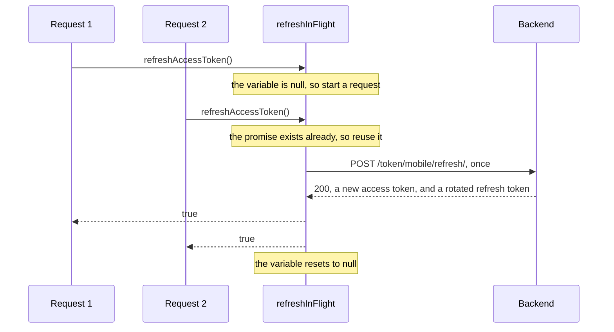

# Authentication (mobile)

This document covers the authentication logic of the mobile app. The backend logic is documented in
[`backend/pinit_api/doc/authentication.md`](../../backend/pinit_api/doc/authentication.md).
The web authentication logic is different than mobile's and is documented in
[`web/doc/authentication.md`](../../web/doc/authentication.md).

## What the device holds

| Value | Where it lives | How it is sent |
|---|---|---|
| Access token | `expo-secure-store` | in an `Authorization: Bearer …` header |
| Refresh token | `expo-secure-store` | in the JSON body of a token request |
| Expiry date of the access token | `AsyncStorage` | never sent |

An access token lasts 15 minutes. A refresh token lasts 30 days.

Both tokens sit in the keychain, so both survive a cold start. The app therefore
starts with a token that is either usable or stale, and the launch gate decides
which.

## The three auth states

The authentication context
([`src/contexts/authenticationContext.tsx`](../src/contexts/authenticationContext.tsx))
is a reducer over two booleans. Here is their respective value in the three auth
states:

| State | `isCheckingAccessToken` | `isAuthenticated` | What renders |
|---|---|---|---|
| Checking | `true` | `false` | nothing |
| Unauthenticated | `false` | `false` | `UnauthenticatedNavigator` |
| Authenticated | `false` | `true` | `AuthenticatedNavigator` |

The app reaches **Checking** once, on the first render. No transition goes back
to it. Every later transition is a state change in React.

The five actions above are the only way to change that state. `LOGGED_OUT` and
`GOT_401_RESPONSE` produce the same state. They stay separate because they say
why the session ended, which a reader of a call site needs to know.

**Mobile has no expired state, and no login prompt.** A dead session unmounts
the authenticated navigator, so the screen the user was on is gone, together
with its scroll position and its form. Web keeps the URL and opens a modal over
the page. This is the one place where the mobile experience is plainly weaker.

## When the app refreshes the access token

The app refreshes the access token at two moments only:

1. Once at launch, and only if the stored token needs it: see
   [Launch: the gate](#launch-the-gate).
2. After a 401: `useAPI().fetchAuthenticated` refreshes once. If the refresh
   returns a token, the app retries the request. If the refresh fails, the
   session ends. See [The refresh after a 401](#the-refresh-after-a-401).

No timer refreshes the token in the background. Between those two moments the
app keeps using the stored token, and it learns that the token expired only when
a request returns 401.

The launch refresh runs when the stored expiry is missing, unreadable, or less
than `TOKEN_REFRESH_BUFFER_BEFORE_EXPIRATION_MS` (2 minutes) away. That buffer
stays well below the 15-minute lifetime, so a normal launch sends no refresh
request at all.

## Launch: the gate

[`NavigationContainer`](../src/components/NavigationContainer/NavigationContainer.tsx)
chooses the navigator to render. It refreshes a near-expired token **before** the
authenticated tree mounts, so no authenticated screen fires a request with a
stale token and gets logged out by a 401 that the gate can prevent.

1. The container reads the access token from secure store.
2. **The read fails, or the store holds no token** → dispatch
   `CHECKED_NO_ACCESS_TOKEN`, and render the login tree.
3. **The store holds a token** → call `ensureFreshAccessToken()`, and act on its
   answer:
   - **The session is usable** → dispatch `FOUND_ACCESS_TOKEN`.
   - **The session cannot be refreshed** → call `clearStoredAuthData()`, then
     dispatch `CHECKED_NO_ACCESS_TOKEN`.

The gate clears the stored data on the failing path for a reason. A stale token
that stays in the keychain sends the user into the authenticated tree on the
next launch, and out of it again on the first request.

While `isCheckingAccessToken` is `true`, the container returns `null`. Nothing
flashes, because nothing renders.

## Login

The app has no signup screen, although the backend exposes
`POST /accounts/mobile/`. Login is therefore the only way in.

| Flow | Container | Endpoint |
|---|---|---|
| Login | [`LoginScreenContainer`](../src/navigators/UnauthenticatedNavigator/LoginScreenContainer.tsx) | `POST /token/mobile/` |

1. The user submits the form. The container validates the email and the password
   before it enables the button.
2. **The backend accepts.** It returns `200` with the access token, the refresh
   token, and the expiry date. The container calls `persistTokensData()`, and
   then dispatches `LOGGED_IN`.
3. **The backend rejects.** It returns `401 { errors: [{ code }] }`. The
   container shows a message for `invalid_email` on the email field, and a
   message for any other code on the password field. Any other failure shows the
   generic error.

## Authenticated requests

### One function per kind of call

`src/lib/api/` is the only directory that calls the `fetch` global. An ESLint
rule (`no-restricted-globals` in [`eslint.config.js`](../eslint.config.js)) bans
that global in the rest of `src/`. Test files are exempt, because they assert on
the `fetch` mock.

| Function | Access token | Used for |
|---|---|---|
| `useAPI().fetchAuthenticated` | `Authorization: Bearer …` | every protected endpoint |
| `useAPI().fetchPublic` | none | the public read endpoints, and the token endpoints |

A call site must name the kind of call it makes, so it cannot drop the access
token by accident. [`useAPI`](../src/lib/api/useAPI.ts) re-exports `fetchPublic`
from [`fetchers.ts`](../src/lib/api/fetchers.ts) unchanged, so one import
reaches both functions.

The token endpoints use `fetchPublic`, because they carry their credentials in
the request body. Web needs a third function for them, because its refresh token
is a cookie.

### The refresh after a 401

`fetchAuthenticated` ([`src/lib/api/useAPI.ts`](../src/lib/api/useAPI.ts))
attaches the access token and recovers from an expired one. Every authenticated
request in the app goes through it. The gate refreshes before launch, but a
token can still be rejected in the middle of a session, after clock skew or a
revocation on the server.

The retry runs once. `fetchAuthenticated` returns whatever that retry gives,
including a second 401.

`fetchAuthenticated` throws `MissingAccessTokenError` when the store holds no
access token at all. That case is a bug in the caller, not an expired session,
because only the authenticated tree calls this function.

**Persisting the rotated refresh token is not optional.** Every refresh revokes
the token that it received. A client that keeps the old value cannot refresh a
second time.

### Two 401s share one refresh

`refreshAccessToken`
([`src/lib/utils/authentication.ts`](../src/lib/utils/authentication.ts)) is
single-flight. It stores the promise of a running refresh in a module variable,
and it hands that same promise to any caller that arrives while the request is
open.

This matters because refresh tokens rotate. Two refreshes in parallel would
present the same token. The backend would accept the first one and reject the
rest as already rotated, and the user would land on the landing screen.

## How a session ends

A session ends in two ways. The user logs out, or a refresh fails. Both ways
clear every stored value, and both return the app to the login tree.

### Logout

[`ProfileScreen`](../src/navigators/BrowseMainNavigator/ProfileScreen.tsx) calls
`logOut()`, and then dispatches `LOGGED_OUT`. An overlay covers the screen while
that runs.

1. `logOut()` reads the refresh token, and sends it to
   `POST /token/mobile/logout/`.
2. The backend revokes that refresh token. Mobile logout therefore gets the same
   server-side revocation as web logout.
3. `logOut()` calls `clearStoredAuthData()`.

**Logout is best-effort.** Step 3 runs whether or not step 1 succeeded, because
a failed request must never leave the user stuck in a logged-in UI. On that path
the refresh token stays valid on the server until it expires.

### A dead session

A refresh fails only when the refresh token is gone, expired or revoked. The
session is therefore over, and no request can save it.

1. `fetchAuthenticated` calls `clearStoredAuthData()`, and dispatches
   `GOT_401_RESPONSE`.
2. `NavigationContainer` renders `UnauthenticatedNavigator`. The authenticated
   tree unmounts, and the user lands on the landing screen.

**No screen carries logout logic of its own.** One function ends the session, so
a new authenticated call site inherits that behaviour and adds nothing. The
consumers of `fetchAuthenticated` handle a 401 as a plain failed request:
[`useMyAccountDetails`](../src/hooks/useMyAccountDetails.ts) reports an error,
and [`PinsBoardContainer`](../src/components/PinsBoard/PinsBoardContainer.tsx)
keeps the pins that it already holds.

**The app does not replay the failed request.** A save that hit the 401 stays
failed, and the user repeats it after a new login. An automatic replay is a good
way to submit something twice.

## Key files

| File | Role |
|---|---|
| [`src/components/NavigationContainer/NavigationContainer.tsx`](../src/components/NavigationContainer/NavigationContainer.tsx) | The launch gate. Refreshes a near-expired token, and then chooses the navigator. |
| [`src/contexts/authenticationContext.tsx`](../src/contexts/authenticationContext.tsx) | The auth reducer, its two booleans, and its five actions. |
| [`src/lib/api/useAPI.ts`](../src/lib/api/useAPI.ts) | The one hook for API traffic. `fetchAuthenticated` adds the Bearer header, refreshes and retries once on a 401, and ends the session when the refresh fails. |
| [`src/navigators/UnauthenticatedNavigator/LoginScreenContainer.tsx`](../src/navigators/UnauthenticatedNavigator/LoginScreenContainer.tsx) | Login: validation, the token request, and the field-level errors. |
| [`src/navigators/BrowseMainNavigator/ProfileScreen.tsx`](../src/navigators/BrowseMainNavigator/ProfileScreen.tsx) | The logout button. |
