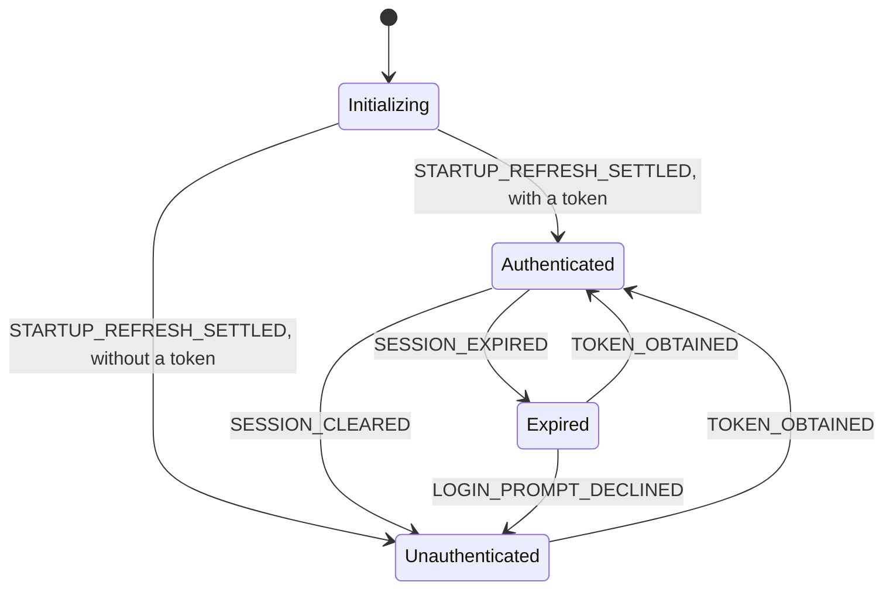
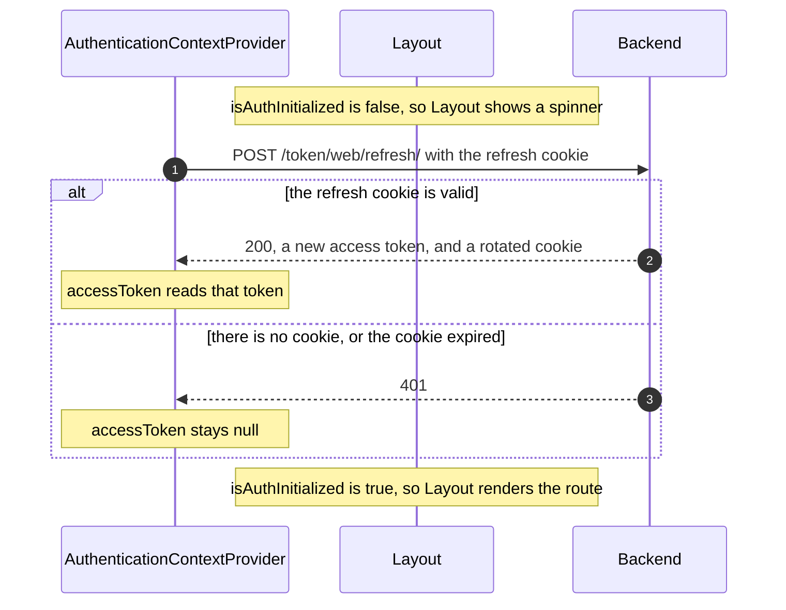
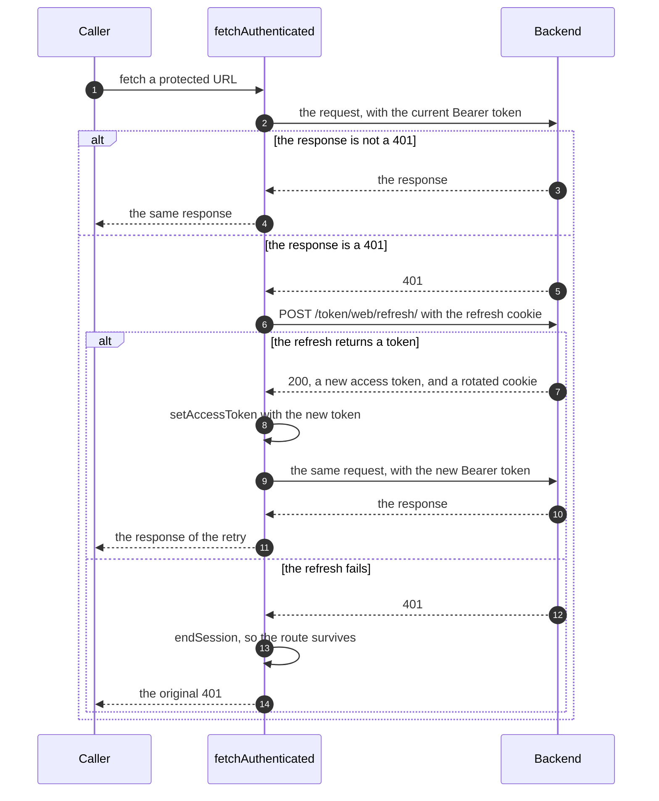
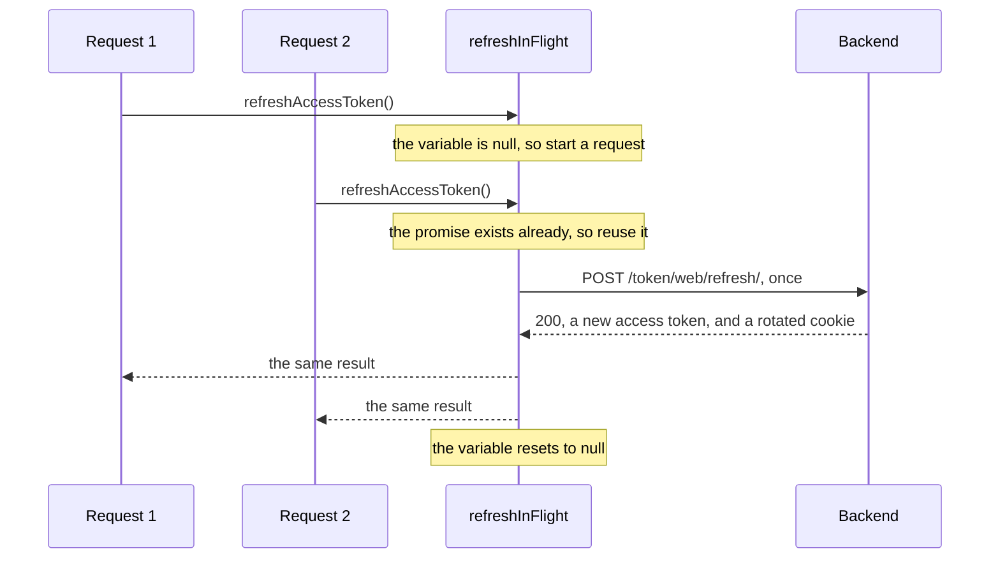

# Authentication (web)

This document covers the authentication logic of the web app. The backend logic is documented in
[`backend/pinit_api/doc/authentication.md`](../../backend/pinit_api/doc/authentication.md).
The mobile authentication logic is different than web's and is documented in
[`mobile/doc/authentication.md`](../../mobile/doc/authentication.md).

## What the browser holds

| Token | Where it lives | Can a script read it | How it is sent |
|---|---|---|---|
| **Access token** | React context, in memory | Yes | in an `Authorization: Bearer …` header |
| **Refresh token** | httpOnly cookie, named `refreshToken` | No | the browser attaches it |

An access token lasts 15 minutes, and it exists only in memory, so a closed tab takes it with it.

A refresh token lasts 30 days. It sits in an httpOnly cookie, so no script can read it. The backend sets, rotates and clears that cookie. The web code never sees its value.

## The four auth states

The authentication context (`src/contexts/authenticationContext.tsx`) is a reducer over one value, `status`, and the five actions above are the only way to change it. A token belongs to the `authenticated` state and exists nowhere else, so no combination outside this table can occur:

| State (`status`) | `accessToken` | `isAuthInitialized` | `isPromptingLogin` | What renders |
|---|---|---|---|---|
| `initializing` | `null` | `false` | `false` | the shell that the cached username suggests, with a spinner in place of the route |
| `unauthenticated` | `null` | `true` | `false` | the unauthenticated shell and the route |
| `authenticated` | a token | `true` | `false` | the authenticated shell and the route |
| `expired` | `null` | `true` | `true` | the unauthenticated shell, the route, and the login modal |

The three columns after the state are derived, not stored. `accessToken` reads the
token of the `authenticated` state, `isAuthInitialized` is any state other than
`initializing`, and `isPromptingLogin` is the `expired` state. Consumers read
those three names and never see `status` itself.

The app reaches **Initializing** once, on the first render. No transition goes
back to it, because the app never reloads the document. Every later transition
is a state change in React.

**Expired** differs from **Unauthenticated** in two ways only. The login modal
opens by itself, and a route that requires a login keeps its URL instead of
sending the user home. Three components read `isPromptingLogin`:

- `HeaderUnauthenticated` opens the login modal.
- `LoginFormContainer` shows the reason inside the form.
- `PinCreationToolPage` keeps its URL.

## When the app refreshes the access token

The app refreshes the access token at two moments only:

1. Once at startup: see [Startup](#startup).
2. After a 401: `useAPI().fetchAuthenticated` refreshes once. If the refresh
   returns a token, the app retries the request. If the refresh fails, the
   session ends. See [The refresh after a 401](#the-refresh-after-a-401).

Between those moments the access token sits in memory. The app learns that the
token expired only when a request returns 401. An access token lasts 15 minutes,
so a refresh happens at most about once per 15 minutes of use.

## The auth context

`AuthenticationContext`
([`src/contexts/authenticationContext.tsx`](../src/contexts/authenticationContext.tsx))
exposes three values, all derived from `status`:

| Value | Type | Meaning |
|---|---|---|
| `accessToken` | `string` or `null` | the token of the `authenticated` state, and `null` in the three others |
| `isAuthInitialized` | `boolean` | `false` until the startup refresh finishes |
| `isPromptingLogin` | `boolean` | `true` while the app asks the user to log back in |

It also exposes the four ways to change the state. Each one dispatches one
action, so a caller states an intent and never touches `status`:

| Function | Action | Called by |
|---|---|---|
| `setAccessToken(token)` | `TOKEN_OBTAINED` | a login, a signup, a refresh after a 401 |
| `clearSession()` | `SESSION_CLEARED` | logout |
| `endSession()` | `SESSION_EXPIRED` | a failed refresh |
| `stopPromptingLogin()` | `LOGIN_PROMPT_DECLINED` | the login modal, when the user closes it or moves to signup |

`clearSession` and `endSession` both clear the cached `username` and
`profilePictureURL` in `localStorage`. The reducer stays pure, so those two
removals happen in the functions rather than in the reducer.

`isAuthInitialized` separates "the app has not checked yet" from "the app
checked, and the user is not logged in". Without that flag, every page load
would render as logged out for a moment, even for a user with a valid session.

Logout calls `clearSession`, so no prompt appears: the user asked to leave. A
failed refresh calls `endSession`, so the prompt does appear.

### Where the token comes from

Two sources supply a token, and they can arrive in either order:

| Source | Dispatches |
|---|---|
| The startup refresh | `STARTUP_REFRESH_SETTLED`, from the effect that runs once on mount |
| A login, a signup, or a refresh after a 401 | `TOKEN_OBTAINED`, through `setAccessToken` |

**A late startup refresh must not undo a session that already ended, or one that
already started.** The user can log in while the startup request is still open,
on a slow network, and a request can fail with a 401 in that window too. The
reducer therefore ignores `STARTUP_REFRESH_SETTLED` unless the state is still
`initializing`. Whoever acted explicitly wins, whatever the network does
afterwards.

**A decline outside the `expired` state changes nothing.** A decline and a logout
produce the same state, so the reducer ignores `LOGIN_PROMPT_DECLINED` unless the
app is prompting. Without that guard, a stray call would end a healthy session.

## Startup

`AuthenticationContextProvider` calls `refreshAccessToken()` once, in an effect
on mount, against `POST /token/web/refresh/`. The browser attaches the httpOnly
cookie. `Layout` puts a spinner in place of the routed page until that attempt
finishes.

A reload destroys the access token, so the first render happens before the
answer arrives. `Layout` therefore guesses the shell from `localStorage`. A
cached `username` means that this browser held a session, so `Layout` renders
the authenticated header at once. A returning user never sees a **Log in**
button that the app takes back a moment later.

The guess covers the shell only. The routed page waits for a real access token.
The guess also ends when the refresh settles, and the token decides from then
on. Only logout clears the cached username, so a refresh cookie that expired on
its own leaves that value behind.

The refresh runs once. It does not retry, and no later event repeats it.
`refreshAccessToken()` never rejects: a rejected request and a 401 both resolve
to no token, so `isAuthInitialized` becomes `true` on every path.

## Login and signup

Both flows return an access token in the body, and both make the backend set the
refresh cookie. Neither flow needs a page reload.

| Flow | Hook | Endpoint |
|---|---|---|
| Login | [`useLogin`](../src/lib/hooks/useLogin.ts) | `POST /token/web/` |
| Signup | [`useSignup`](../src/lib/hooks/useSignup.ts) | `POST /accounts/web/` |

1. The user submits the form.
2. **The backend accepts.** It returns `200 { access_token }` and the httpOnly
   refresh cookie. The hook calls `setAccessToken(token)`, and the authenticated
   shell renders.
3. **The backend rejects.** It returns `401 { errors: [{ code }] }`. The form
   shows an error on the field that matches the code.

## Authenticated requests

### One function per kind of call

`src/lib/api/` is the only directory that calls the `fetch` global. An ESLint
rule (`no-restricted-globals` in `eslint.config.mjs`) bans that global in the
rest of `src/`. Test files are exempt, because they assert on the `fetch` mock.

| Function | Access token | `credentials` | Used for |
|---|---|---|---|
| `useAPI().fetchAuthenticated` | `Authorization: Bearer …` | not set | every protected endpoint |
| `useAPI().fetchPublic` | none | not set | the public read endpoints |
| `fetchWithRefreshCookie` | none | `"include"` | login, signup, logout, refresh |
| `useAPI().fetchExternal` | none | `"omit"` | the S3 upload, a pin image download |

Only the last two functions set `credentials`, and each one states a rule.
`fetchWithRefreshCookie` must send the refresh cookie, so it includes
credentials. `fetchExternal` must never send it, so it omits credentials. No
cookie and no token of ours reaches another origin. The first two functions
leave the browser default in place.

### The refresh after a 401

`fetchAuthenticated` ([`src/lib/api/useAPI.ts`](../src/lib/api/useAPI.ts))
attaches the access token and recovers from an expired one. This is the
mechanism that keeps a session alive without the user noticing. Every
authenticated fetch in the app goes through it.

The retry runs once. `fetchAuthenticated` returns whatever that retry gives,
including a second 401. Rotation stays invisible here, because each refresh sets
the cookie again on the server, and the browser stores it.

### Two 401s share one refresh

`refreshAccessToken` ([`src/lib/api/refreshAccessToken.ts`](../src/lib/api/refreshAccessToken.ts))
is single-flight. It keeps the promise of a running refresh in a module variable,
and it hands that same promise to any caller that arrives while the request is
open. Two 401s at the same time therefore wait for one refresh.

This matters because refresh tokens rotate. Two refreshes in parallel would
present the same cookie. The backend would accept the first one and reject the
rest as already rotated, and the user would land on the login modal.

The startup refresh calls the same function, so it shares the deduplication. A
401 that lands while the startup refresh is open therefore waits for it.

## How a session ends

A session ends in two ways. The user logs out, or a refresh fails. Neither way
reloads the document. The app is a single-page app, and a reload throws away the
router, the query cache and every component state, to reach a result that React
already gives.

### Logout

`useLogOut` ([`src/lib/hooks/useLogOut.ts`](../src/lib/hooks/useLogOut.ts)) ends
the session on the server and in the browser.

1. `useLogOut` sends `DELETE /token/web/`. The browser attaches the cookie.
2. The backend revokes the refresh token and clears the cookie.
3. `useLogOut` calls `clearSession()`, drops the cached queries, and navigates
   to `/` with the router.

Step 3 runs whether or not step 1 succeeded. **Logout is best-effort.** A failed
request must never leave the user stuck in a logged-in UI. On that path the
refresh token stays valid on the server until it expires.

**Which cached queries the app drops.** Every one of them. The next person to log
in on the same browser can be somebody else. Only one query key carries the
access token. The others do not, so a cached entry would survive the change and
appear as the new user's data. No auth state lives in the cache, so nothing here
needs sparing.

### An expired session

A refresh fails only when the refresh token is gone, expired or revoked. The
session is therefore over, and no request can save it.

1. `fetchAuthenticated` calls `endSession()`.
2. `Layout` swaps to the unauthenticated shell. **The URL does not change.**
3. `HeaderUnauthenticated` mounts, reads `isPromptingLogin`, and opens the login
   modal. `LoginFormContainer` adds the reason inside the form.
4. The user logs in. `setAccessToken` stores the token and clears the flag, the
   authenticated shell returns, and the queries run again on the same route.

The cached queries stay on this path. The person who logs back in is the same
person, so the data belongs to them.

If the user declines instead, `stopPromptingLogin()` clears the flag, and the app
is plainly **Unauthenticated**. A close of the modal counts as a decline, and so
does a move to the signup form.

**Routes that require a login.** `PinCreationToolPage` sends the user to `/` when
no token exists, and that would destroy the URL before the user can act. While
`isPromptingLogin` is `true`, the page therefore renders nothing and keeps the
URL. The login modal covers the page anyway. Once the flag clears, the page
sends the user home.

**The app does not replay the failed request.** A save that hit the 401 stays
failed, and the user repeats it. An automatic replay after a new login is a good
way to submit something twice.

## Key files

| File | Role |
|---|---|
| [`src/contexts/authenticationContext.tsx`](../src/contexts/authenticationContext.tsx) | `AuthenticationContext` and its provider. The reducer over `status`, the startup refresh, the three derived values, and the four functions that dispatch. |
| [`src/components/Header/HeaderUnauthenticated.tsx`](../src/components/Header/HeaderUnauthenticated.tsx) | Holds the login and signup modals. Opens the login modal by itself after an expiry. |
| [`src/lib/api/useAPI.ts`](../src/lib/api/useAPI.ts) | The one hook for API traffic. `fetchAuthenticated` adds the Bearer header, refreshes and retries once on a 401, and ends the session when the refresh fails. |
| [`src/lib/api/refreshAccessToken.ts`](../src/lib/api/refreshAccessToken.ts) | The single-flight refresh, used by the startup refresh and by the refresh after a 401. |
