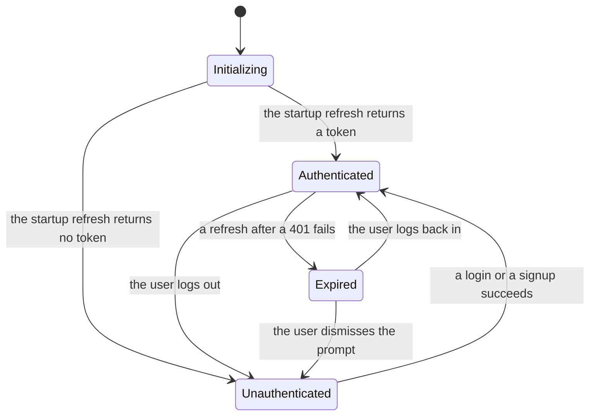
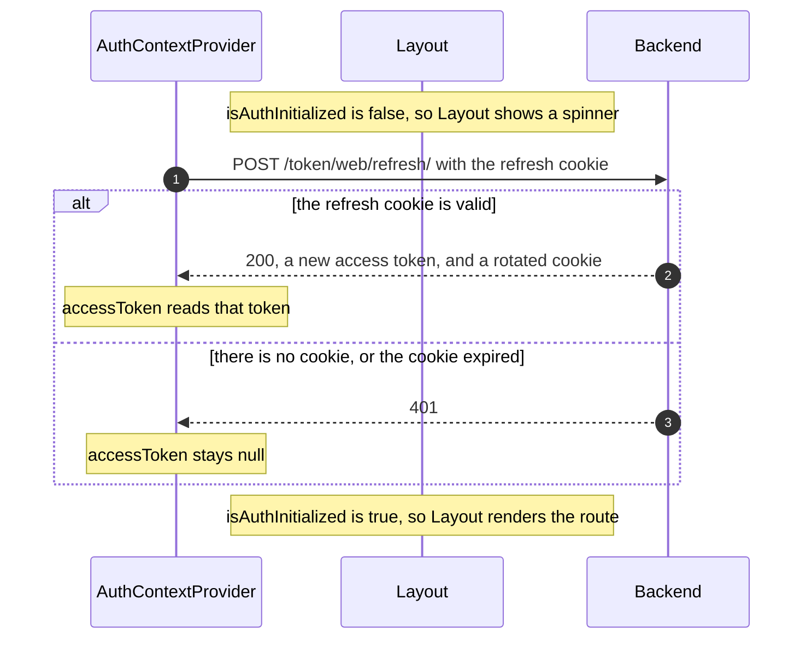
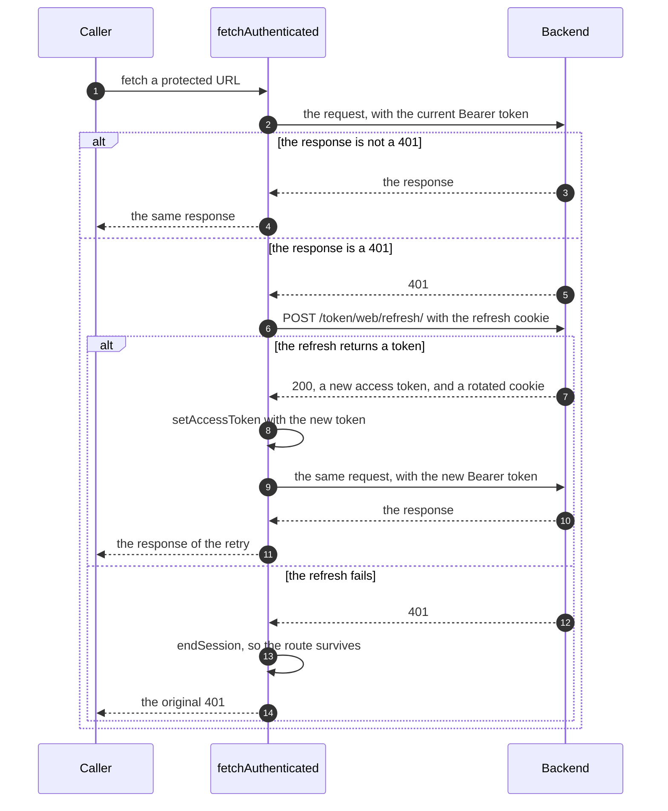
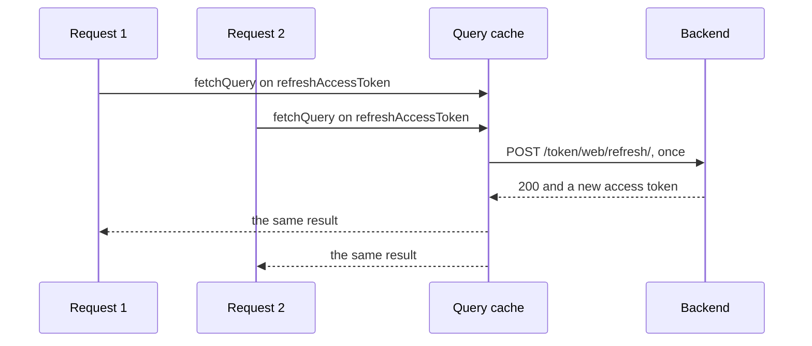

# Authentication (web)

This document covers the authentication logic of the web app. The backend logic is documented in
[`backend/pinit_api/doc/authentication.md`](../../backend/pinit_api/doc/authentication.md).
The mobile authentication logic is different than web's and is documented in
[`mobile/doc/authentication.md`](../../mobile/doc/authentication.md).

## What the browser holds

| Token | Where it lives | Can a script read it | How it is sent |
|---|---|---|---|
| **Access token** | React context, in memory | Yes | in an `Authorization: Bearer …` header |
| **Refresh token** | httpOnly cookie, named `refreshToken` | No | the browser attaches it |

An access token lasts 15
minutes, and it exists only in memory, so a closed tab takes it with it.

A refresh token lasts 30 days. It sits in an httpOnly cookie, so no script can
read it. The backend sets, rotates and clears that cookie. The web code never
sees its value.

## The four auth states

The authentication context (`src/contexts/authContext.tsx`) exposes three state variables: `accessToken`, `isAuthInitialized` and `isPromptingLogin`. Here is their respective value in the four auth states:

| State | `accessToken` | `isAuthInitialized` | `isPromptingLogin` | What renders |
|---|---|---|---|---|
| Initializing | `null` | `false` | `false` | the unauthenticated shell, with a spinner in place of the route |
| Unauthenticated | `null` | `true` | `false` | the unauthenticated shell and the route |
| Authenticated | a token | `true` | `false` | the authenticated shell and the route |
| Expired | `null` | `true` | `true` | the unauthenticated shell, the route, and the login modal |

The app reaches **Initializing** once, on the first render. No transition goes
back to it, because the app never reloads the document. Every later transition
is a state change in React.

**Expired** differs from **Unauthenticated** in two ways only. The login modal
opens by itself, and a route that requires a login keeps its URL instead of
sending the user home. Three components read `isPromptingLogin`:

- `HeaderUnauthenticated` opens the login modal.
- `LoginFormContainer` shows the reason inside the form.
- `PinCreationToolPage` keeps its URL.

## When the app refreshes the access token

The app refreshes the access token at two moments only:

1. Once at startup: see [Startup](#startup).
2. After a 401: `useAPI().fetchAuthenticated` refreshes once. If the refresh
   returns a token, the app retries the request. If the refresh fails, the
   session ends. See [The refresh after a 401](#the-refresh-after-a-401).

Between those moments the access token sits in memory. The app learns that the
token expired only when a request returns 401. An access token lasts 15 minutes,
so a refresh happens at most about once per 15 minutes of use.

## The auth context

`AuthContext` ([`src/contexts/authContext.tsx`](../src/contexts/authContext.tsx))
holds the auth state:

| Value | Type | Meaning |
|---|---|---|
| `accessToken` | `string` or `null` | `null` until the startup refresh or a login supplies a token |
| `isAuthInitialized` | `boolean` | `false` until the startup refresh finishes |
| `isPromptingLogin` | `boolean` | `true` while the app asks the user to log back in |

It also exposes the four ways to change that state:

| Function | What it does | Called by |
|---|---|---|
| `setAccessToken(value)` | Stores a token, or stores `null`. A token also stops the login prompt. | a login, a signup, a refresh after a 401 |
| `clearSession()` | Drops the token, and the cached `username` and `profilePictureURL` in `localStorage`. Asks the user for nothing. | logout |
| `endSession()` | Runs `clearSession()`, and then asks for a new login. | a failed refresh |
| `stopPromptingLogin()` | Stops the prompt, because the user declined. | the login modal, when the user closes it or moves to signup |

`isAuthInitialized` separates "the app has not checked yet" from "the app
checked, and the user is not logged in". Without that flag, every page load
would render as logged out for a moment, even for a user with a valid session.

Logout calls `clearSession`, so no prompt appears: the user asked to leave. A
failed refresh calls `endSession`, so the prompt does appear.

### Where the token comes from

The provider stores only two values in its state: `explicitAccessToken` and
`isPromptingLogin`. It computes `accessToken` and `isAuthInitialized` on every
render.

If `explicitAccessToken` is not `undefined`, then `accessToken` is that value.
If it is `undefined`, then `accessToken` is the token from the startup refresh,
or `null`.

`explicitAccessToken` therefore carries three meanings:

| Value | Meaning | Written by |
|---|---|---|
| `undefined` | Nobody set a token. `accessToken` follows the startup refresh. | the initial state |
| `null` | A token is absent on purpose, and this beats the refresh result. | `clearSession`, and therefore logout and a failed refresh |
| a string | A token arrived outside the startup refresh. | a login, a signup, a refresh after a 401 |

**Why `null` and `undefined` must differ.** The result of the startup refresh
stays in the query cache, and `undefined` means "follow that result". After a
logout, that cached result still holds a valid token, because the app does not
reload. So `clearSession` writes `null`, and `null` wins. This is also why
logout can leave the refresh entry in the cache. See
[Logout](#logout).

## Startup

`AuthContextProvider` runs one query on mount against
`POST /token/web/refresh/`. The browser attaches the httpOnly cookie. `Layout`
holds the route back until that attempt finishes, to avoid a flash of
unauthenticated UI.

The refresh query does not retry, and it does not run again when the window
regains focus. A rejected refresh gives no token instead of an error, so
`isAuthInitialized` becomes `true` on both paths.

## Login and signup

Both flows return an access token in the body, and both make the backend set the
refresh cookie. Neither flow needs a page reload.

| Flow | Hook | Endpoint |
|---|---|---|
| Login | [`useLogin`](../src/lib/hooks/useLogin.ts) | `POST /token/web/` |
| Signup | [`useSignup`](../src/lib/hooks/useSignup.ts) | `POST /accounts/web/` |

1. The user submits the form.
2. **The backend accepts.** It returns `200 { access_token }` and the httpOnly
   refresh cookie. The hook calls `setAccessToken(token)`, and the authenticated
   shell renders.
3. **The backend rejects.** It returns `401 { errors: [{ code }] }`. The form
   shows an error on the field that matches the code.

## Authenticated requests

### One function per kind of call

`src/lib/api/` is the only directory that calls the `fetch` global. An ESLint
rule (`no-restricted-globals` in `eslint.config.mjs`) bans that global in the
rest of `src/`. Test files are exempt, because they assert on the `fetch` mock.

| Function | Access token | `credentials` | Used for |
|---|---|---|---|
| `useAPI().fetchAuthenticated` | `Authorization: Bearer …` | not set | every protected endpoint |
| `useAPI().fetchPublic` | none | not set | the public read endpoints |
| `fetchWithRefreshCookie` | none | `"include"` | login, signup, logout, refresh |
| `useAPI().fetchExternal` | none | `"omit"` | the S3 upload, a pin image download |

Only the last two functions set `credentials`, and each one states a rule.
`fetchWithRefreshCookie` must send the refresh cookie, so it includes
credentials. `fetchExternal` must never send it, so it omits credentials. No
cookie and no token of ours reaches another origin. The first two functions
leave the browser default in place.

### The refresh after a 401

`fetchAuthenticated` ([`src/lib/api/useAPI.ts`](../src/lib/api/useAPI.ts))
attaches the access token and recovers from an expired one. This is the
mechanism that keeps a session alive without the user noticing. Every
authenticated fetch in the app goes through it.

The retry runs once. `fetchAuthenticated` returns whatever that retry gives,
including a second 401. Rotation stays invisible here, because each refresh sets
the cookie again on the server, and the browser stores it.

### Two 401s share one refresh

The refresh runs through the query cache. `fetchAuthenticated` calls
`queryClient.fetchQuery` on the shared `["refreshAccessToken"]` key. Two 401s at
the same time therefore wait for one refresh in flight, instead of starting one
each.

This matters because refresh tokens rotate. Two refreshes in parallel would
present the same cookie. The backend would accept the first one and reject the
rest as already rotated, and the user would land on the login modal.

The startup refresh uses that same key, so it shares the deduplication.

## How a session ends

A session ends in two ways. The user logs out, or a refresh fails. Neither way
reloads the document. The app is a single-page app, and a reload throws away the
router, the query cache and every component state, to reach a result that React
already gives.

### Logout

`useLogOut` ([`src/lib/hooks/useLogOut.ts`](../src/lib/hooks/useLogOut.ts)) ends
the session on the server and in the browser.

1. `useLogOut` sends `DELETE /token/web/`. The browser attaches the cookie.
2. The backend revokes the refresh token and clears the cookie.
3. `useLogOut` calls `clearSession()`, drops the cached queries, and navigates
   to `/` with the router.

Step 3 runs whether or not step 1 succeeded. **Logout is best-effort.** A failed
request must never leave the user stuck in a logged-in UI. On that path the
refresh token stays valid on the server until it expires.

**Which cached queries the app drops.** Every query except the startup refresh.
The next person to log in on the same browser can be somebody else. Only one
query key carries the access token. The others do not, so a cached entry would
survive the change and appear as the new user's data.

The startup refresh entry stays, for two reasons. `AuthContextProvider` watches
that entry, so a removal starts a new fetch, which turns `isAuthInitialized`
back to `false` and paints a spinner over the route. And the cached token is
harmless, because `clearSession` writes an explicit `null`, and `null` wins. See
[Where the token comes from](#where-the-token-comes-from).

### An expired session

A refresh fails only when the refresh token is gone, expired or revoked. The
session is therefore over, and no request can save it.

1. `fetchAuthenticated` calls `endSession()`.
2. `Layout` swaps to the unauthenticated shell. **The URL does not change.**
3. `HeaderUnauthenticated` mounts, reads `isPromptingLogin`, and opens the login
   modal. `LoginFormContainer` adds the reason inside the form.
4. The user logs in. `setAccessToken` stores the token and clears the flag, the
   authenticated shell returns, and the queries run again on the same route.

The cached queries stay on this path. The person who logs back in is the same
person, so the data belongs to them.

If the user declines instead, `stopPromptingLogin()` clears the flag, and the app
is plainly **Unauthenticated**. A close of the modal counts as a decline, and so
does a move to the signup form.

**Routes that require a login.** `PinCreationToolPage` sends the user to `/` when
no token exists, and that would destroy the URL before the user can act. While
`isPromptingLogin` is `true`, the page therefore renders nothing and keeps the
URL. The login modal covers the page anyway. Once the flag clears, the page
sends the user home.

**The app does not replay the failed request.** A save that hit the 401 stays
failed, and the user repeats it. An automatic replay after a new login is a good
way to submit something twice.

## Key files

| File | Role |
|---|---|
| [`src/contexts/authContext.tsx`](../src/contexts/authContext.tsx) | `AuthContext` and its provider. Runs the startup refresh. Exposes `accessToken` and `isAuthInitialized`, both computed, plus `isPromptingLogin` and the three session functions. |
| [`src/components/Header/HeaderUnauthenticated.tsx`](../src/components/Header/HeaderUnauthenticated.tsx) | Holds the login and signup modals. Opens the login modal by itself after an expiry. |
| [`src/lib/api/useAPI.ts`](../src/lib/api/useAPI.ts) | The one hook for API traffic. `fetchAuthenticated` adds the Bearer header, refreshes and retries once on a 401, and ends the session when the refresh fails. |
| [`src/lib/api/refreshAccessToken.ts`](../src/lib/api/refreshAccessToken.ts) | The shared refresh key and fetcher, used by the startup refresh and by the refresh after a 401. |
