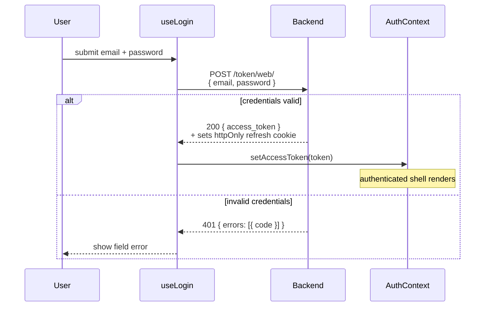
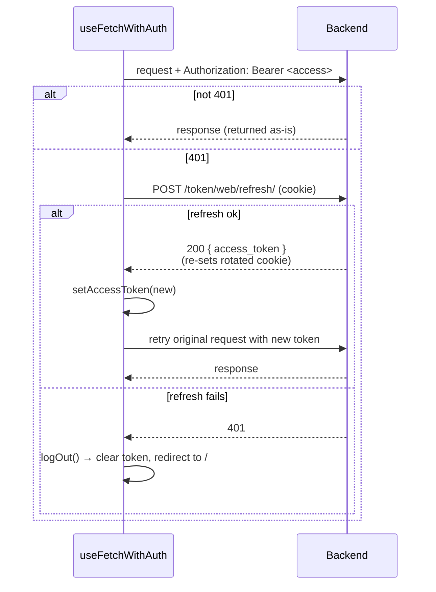
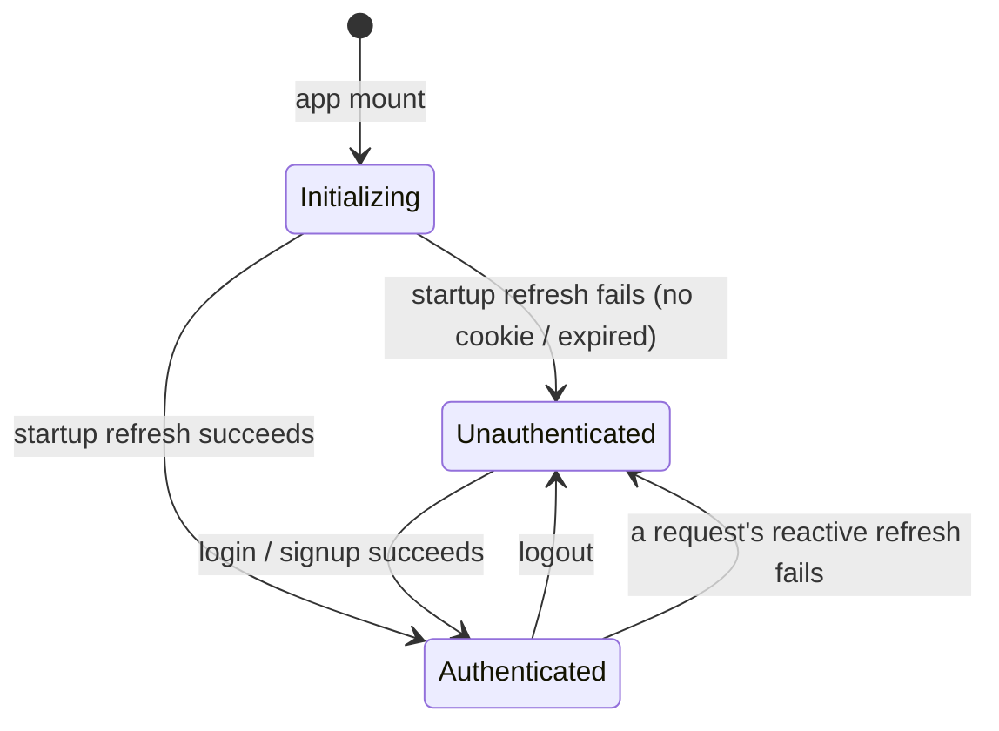

# Authentication (web)

> This document covers the **web frontend**: how it stores tokens, drives the
> auth lifecycle, and talks to the auth endpoints. For the token protocol itself
> (PASETO access tokens, opaque rotating refresh tokens, verification, and
> revocation) see the backend reference:
> [`backend/pinit_api/doc/authentication.md`](../../backend/pinit_api/doc/authentication.md).
> The mobile app uses a different delivery mechanism — see
> [`mobile/doc/authentication.md`](../../mobile/doc/authentication.md).

## Overview

The web frontend holds the two tokens as follows:

| Token | Where stored | Accessible to JS | Sent as |
|---|---|---|---|
| **Access token** | React context (in-memory) | Yes | `Authorization: Bearer …` header |
| **Refresh token** | httpOnly cookie (`refreshToken`) | No | sent automatically by the browser |

Keeping the access token in memory (not `localStorage`) limits XSS exposure;
keeping the refresh token in an httpOnly cookie prevents any script from reading
it. The refresh token cookie is set, rotated, and cleared entirely by the
backend — the web code never sees its value.

## Auth state

`AuthContext` ([`src/contexts/authContext.tsx`](../src/contexts/authContext.tsx))
is the single source of truth:

```
accessToken: string | null   — null until obtained via startup refresh or login
isAuthInitialized: boolean   — false until the startup refresh attempt settles
```

`isAuthInitialized` distinguishes "we haven't checked yet" from "we checked and
the user is unauthenticated". Without it, the app would briefly render as logged
out on every page load, even for authenticated users.

## Flows

### 1. App startup

`AuthContextProvider` runs a one-shot [TanStack Query](https://tanstack.com/query)
on mount that calls the refresh endpoint (the browser attaches the httpOnly
cookie automatically). `Layout` withholds the routed content until the attempt
settles, to avoid a flash of unauthenticated UI.

```mermaid
sequenceDiagram
    participant Browser
    participant AuthContextProvider
    participant Layout
    participant Backend

    Browser->>AuthContextProvider: mount
    note over AuthContextProvider: isAuthInitialized = false
    AuthContextProvider->>Backend: POST /token/web/refresh/<br/>(sends httpOnly cookie automatically)

    alt refresh token valid
        Backend-->>AuthContextProvider: 200 { access_token }<br/>(re-sets rotated refresh cookie)
        AuthContextProvider->>AuthContextProvider: setAccessToken(token)<br/>setIsAuthInitialized(true)
    else no cookie / expired
        Backend-->>AuthContextProvider: 401
        AuthContextProvider->>AuthContextProvider: setIsAuthInitialized(true)<br/>(accessToken stays null)
    end
    note over Layout: gates &lt;Outlet /&gt; on isAuthInitialized<br/>(spinner until settled)
```

Once authenticated, `Layout` uses `useAccountDetails` to fetch `/accounts/me/`
and populate `AccountContext` (and cache username / profile-picture URL in
`localStorage`).

### 2. Login / signup

`useLogin` posts credentials to the login endpoint; on success it stores the
returned access token in context. The backend sets the refresh cookie in the
same response, so no page reload is needed. Signup (`useSignup`) is identical —
the backend returns an access token and sets the refresh cookie.



### 3. Authenticated requests (reactive refresh)

`useFetchWithAuth` ([`src/lib/hooks/useFetchWithAuth.ts`](../src/lib/hooks/useFetchWithAuth.ts))
attaches the access token and transparently recovers from expiry. Because access
tokens last only 15 minutes, this is the mechanism that keeps a session alive
without the user noticing. All authenticated data hooks go through it
(`useAccountDetails`, `useCreatePin`, `useUpdatePin`, `useDeletePin`,
`useCreateBoard`, `HomePage`).



Refresh-token rotation is transparent here: each refresh re-sets the cookie
server-side, and the browser stores it automatically.

### 4. Logout

`useLogOut` calls the logout endpoint, clears the in-memory access token, and
reloads to `/`.

```mermaid
sequenceDiagram
    participant User
    participant useLogOut
    participant Backend
    participant Browser

    User->>useLogOut: click logout
    useLogOut->>Backend: DELETE /token/web/ (sends cookie)
    Backend-->>useLogOut: 200 — revokes refresh token, clears cookie
    useLogOut->>Browser: setAccessToken(null); location.href = "/"
    note over Browser: startup refresh now fails → unauthenticated
```

The backend **revokes the refresh token server-side** on logout, so it cannot be
reused. The access token is stateless and only in memory, so it is gone as soon
as the page unloads. Logout is **best-effort**: `useLogOut` clears the token and
redirects even if the request fails, so a failed call never leaves the user
stuck logged in.

### 5. Auth state machine



## Key files

| File | Role |
|---|---|
| [`src/contexts/authContext.tsx`](../src/contexts/authContext.tsx) | `AuthContext` + provider; runs the startup refresh; holds `accessToken`, `isAuthInitialized`. |
| [`src/pages/Layout.tsx`](../src/pages/Layout.tsx) | Gates routed content on `isAuthInitialized`; renders the authenticated vs. unauthenticated shell from `accessToken`. |
| [`src/lib/hooks/useFetchWithAuth.ts`](../src/lib/hooks/useFetchWithAuth.ts) | Adds the Bearer header; reactive refresh + retry on 401; logs out on failed refresh. |
| [`src/lib/hooks/useLogin.ts`](../src/lib/hooks/useLogin.ts) | Login — posts credentials, stores the access token. |
| [`src/lib/hooks/useSignup.ts`](../src/lib/hooks/useSignup.ts) | Signup — same shape as login. |
| [`src/lib/hooks/useLogOut.ts`](../src/lib/hooks/useLogOut.ts) | Logout — calls the endpoint, clears the token, redirects. |
| [`src/lib/hooks/useAccountDetails.ts`](../src/lib/hooks/useAccountDetails.ts) | Fetches `/accounts/me/` once authenticated. |
| [`src/lib/constants.ts`](../src/lib/constants.ts) | API URLs. |
