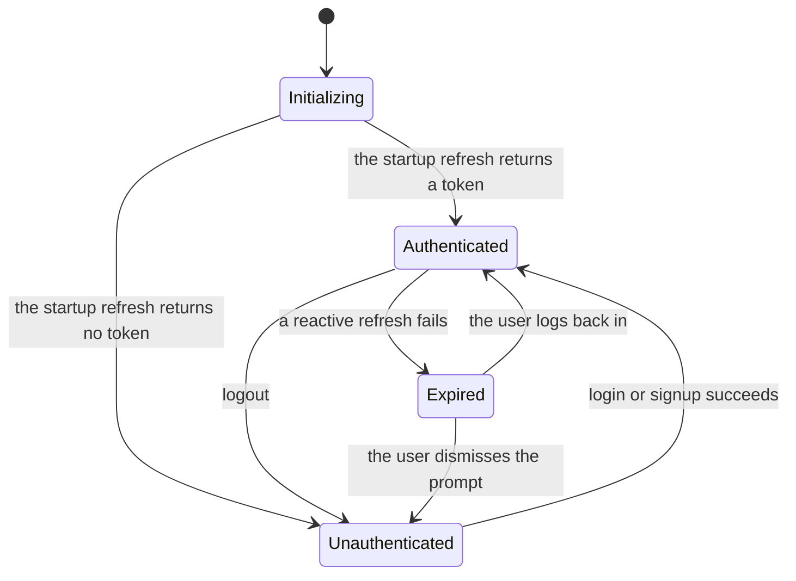
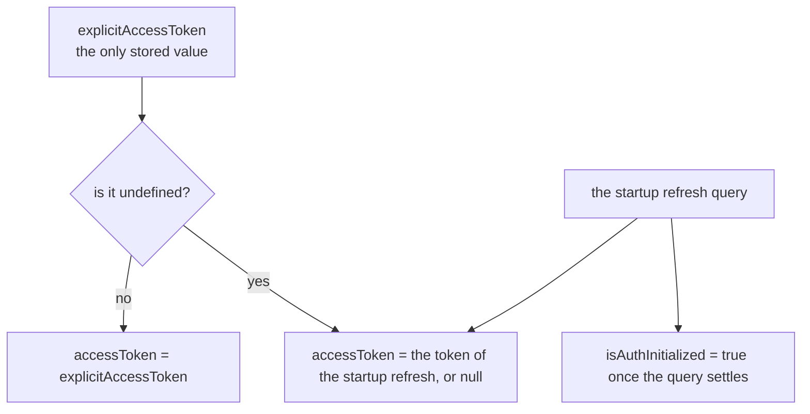
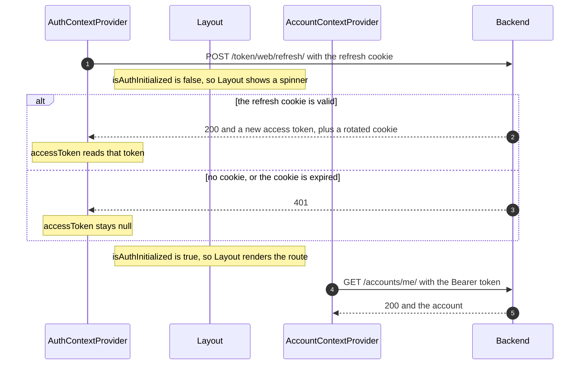
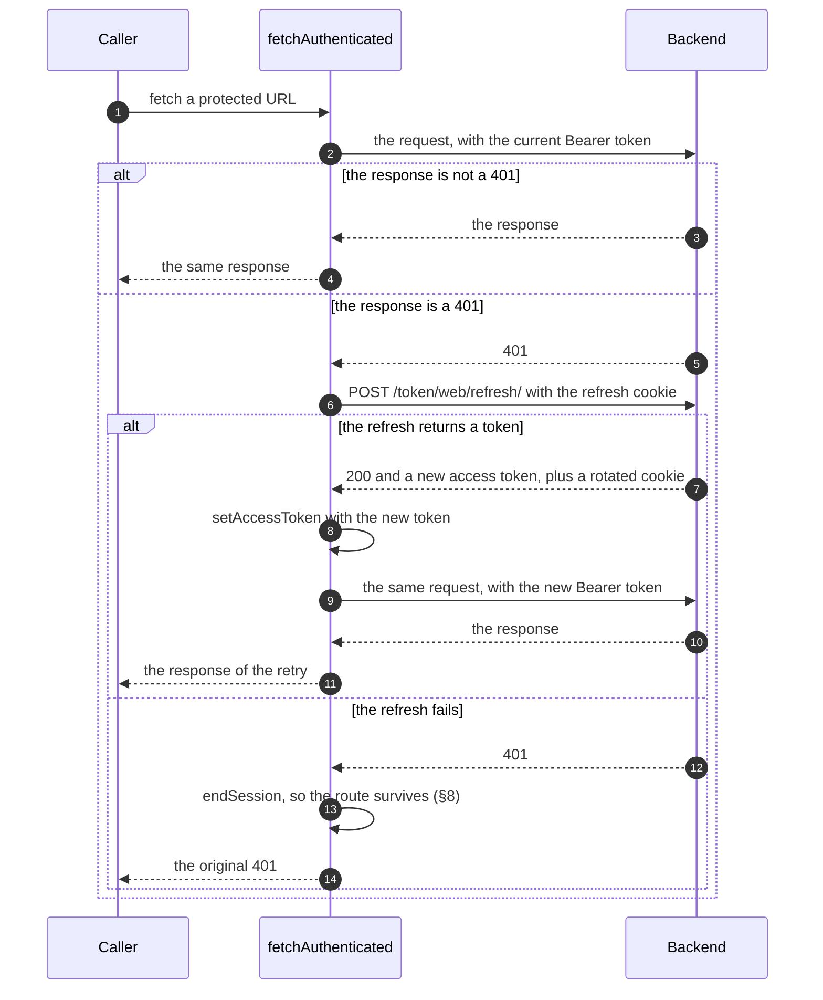
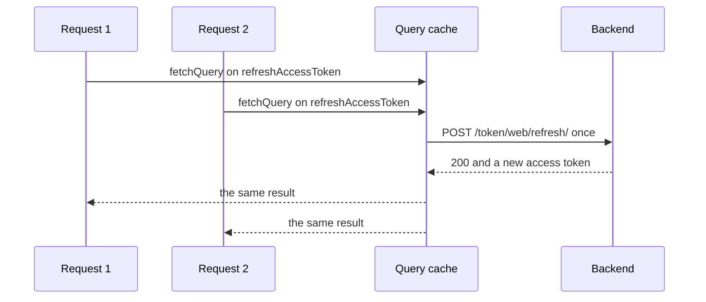

# Authentication (web)

> **Draft, not the live document.** This is a proposed rewrite of
> [`authentication.md`](./authentication.md), kept alongside it for review. A
> follow-up pull request reworks the two into one document.

This document covers the web app: where it keeps the two tokens, how its auth
state changes, and which endpoints it calls. The token protocol itself is
documented in
[`backend/pinit_api/doc/authentication.md`](../../backend/pinit_api/doc/authentication.md).
The mobile app has a different flow, documented in
[`mobile/doc/authentication.md`](../../mobile/doc/authentication.md).

## 1. What the browser holds

| Token | Where | Readable by JS | Sent as |
|---|---|---|---|
| **Access token** | React context, in memory | Yes | `Authorization: Bearer …` header |
| **Refresh token** | httpOnly cookie (`refreshToken`) | No | attached by the browser |

The access token stays out of `localStorage`, which limits XSS exposure. The
httpOnly cookie keeps the refresh token unreadable by any script. The backend
sets, rotates, and clears that cookie. The web code never sees its value.

`localStorage` holds no credential. It holds two display values:

| Key | Value | Written by | Read by |
|---|---|---|---|
| `username` | Username of the logged-in account | the account query (§5) | `HeaderAuthenticatedContainer` |
| `profilePictureURL` | URL of the profile picture | the account query (§5) | `HeaderAuthenticatedContainer` |

Neither value grants access to the API. They let the header paint the profile
link before `/accounts/me/` resolves. Logout removes both (§8).

## 2. The auth lifecycle

The app moves between three states.



**Initializing** is reachable only once, on the first render. No transition
returns to it, because the app never reloads the document. Every later
transition is a state change in React.

| State | `accessToken` | `isAuthInitialized` | `isPromptingLogin` | What renders |
|---|---|---|---|---|
| Initializing | `null` | `false` | `false` | the unauthenticated shell, with a spinner in place of the route |
| Unauthenticated | `null` | `true` | `false` | the unauthenticated shell and the route |
| Authenticated | a token | `true` | `false` | the authenticated shell and the route |
| Expired | `null` | `true` | `true` | the unauthenticated shell, the route, and the login modal |

**Expired** differs from **Unauthenticated** in two ways only: the login modal
opens by itself, and an authenticated-only route holds its URL instead of
redirecting home. Both read `isPromptingLogin`, which is why the flag is named
for the prompt it drives rather than for the expiry that caused it.

## 3. When the access token is refreshed

The app attempts a refresh at exactly two moments. It runs no timer, and it does
not track the expiry of the access token.

1. **Once on app load.** The startup refresh reads the refresh cookie (§5).
2. **After a 401.** `useAPI().fetchAuthenticated` attempts one refresh (§7). If
   the refresh returns a token, it retries the request. If the refresh fails, it
   ends the session (§8).

Between those moments the access token sits in memory. The app discovers an
expired token only when a request returns 401. The access token lasts 15
minutes, so a refresh happens at most about once per 15 minutes of activity.

## 4. Auth state in React

`AuthContext` ([`src/contexts/authContext.tsx`](../src/contexts/authContext.tsx))
exposes the state and the four ways to change it.

```
accessToken: string | null   — null until the startup refresh or a login supplies one
isAuthInitialized: boolean   — false until the startup refresh settles
isPromptingLogin: boolean    — true while the app asks the user to log back in
setAccessToken(value)        — sets an explicit token, or null. A token stops the prompt
clearSession()               — drops the token and the two localStorage values, and asks nothing
endSession()                 — clearSession(), and then ask for a new login
stopPromptingLogin()         — the user declined, so stop asking
```

`isAuthInitialized` separates "not checked yet" from "checked, and the user is
unauthenticated". Without it, every page load would render as logged out for a
moment, even for an authenticated user.

**Why `clearSession` and `endSession` both exist.** A logout is not an expiry.
Logout calls `clearSession`, so no login prompt appears: the user asked to
leave. A failed refresh calls `endSession`, so the prompt does appear.

The provider stores **two** values, `explicitAccessToken` and `isPromptingLogin`.
It computes `accessToken` and `isAuthInitialized` on every render.



`explicitAccessToken` carries three meanings:

| Value | Meaning | Written by |
|---|---|---|
| `undefined` | Nobody set a token. `accessToken` follows the startup refresh. | the initial value |
| `null` | A token is explicitly absent, and this beats the refresh result. | `clearSession`, and therefore logout and a failed reactive refresh |
| a string | A token arrived outside the startup refresh. | login, signup, a reactive refresh |

**Why `null` and `undefined` must differ.** The result of the startup refresh
stays in the query cache, and `undefined` means "follow that result". After a
logout that cached result still holds a valid token, because the app no longer
reloads. So `clearSession` writes `null`, and `null` wins. This is also why
logout can leave the refresh entry in the cache (§8).

## 5. Flow: app startup

`AuthContextProvider` runs one query on mount against
`POST /token/web/refresh/`. The browser attaches the httpOnly cookie. `Layout`
withholds the route until that attempt settles, to avoid a flash of
unauthenticated UI.



The refresh query does not retry, and it does not refetch when the window
regains focus. A rejected refresh resolves to no token rather than to an error,
so `isAuthInitialized` turns `true` on both paths.

### The account query

Once the refresh settles and an access token exists, `AccountContextProvider`
([`src/contexts/accountContext.tsx`](../src/contexts/accountContext.tsx))
fetches `/accounts/me/` through `useAPI().fetchAuthenticated`. The provider hosts that
query and passes its result through the context. The query cache therefore holds
the account. The query function also writes the two `localStorage` values of §1.

The query key carries the access token: `["fetchMyAccountDetails", accessToken]`.
A new access token is therefore a new cache entry. So after a reactive refresh
(§7) replaces the token, the provider fetches `/accounts/me/` again, and
`account` reads `null` until that request resolves. In that window the header
falls back to the `localStorage` values.

## 6. Flow: login and signup

Both flows return an access token in the body, and both make the backend set the
refresh cookie. No page reload is needed.

| Flow | Hook | Endpoint |
|---|---|---|
| Login | [`useLogin`](../src/lib/hooks/useLogin.ts) | `POST /token/web/` |
| Signup | [`useSignup`](../src/lib/hooks/useSignup.ts) | `POST /accounts/web/` |

1. The user submits the form.
2. **The backend accepts** → `200 { access_token }` plus the httpOnly refresh
   cookie. The hook calls `setAccessToken(token)`, and the authenticated shell
   renders.
3. **The backend rejects** → `401 { errors: [{ code }] }`. The form shows an
   error on the matching field.

## 7. Flow: authenticated request and reactive refresh

### One door for every API call

`src/lib/api/` is the only place that calls the `fetch` global. An ESLint rule
(`no-restricted-globals` in `eslint.config.mjs`) bans that global everywhere else
under `src/`, so each call site must name the kind of call it makes.

| Function | Access token | Cookie | Used for |
|---|---|---|---|
| `useAPI().fetchAuthenticated` | `Authorization: Bearer …` | no | every protected endpoint |
| `useAPI().fetchPublic` | no | no | the public read endpoints |
| `fetchWithRefreshCookie` | no | `credentials: "include"` | login, signup, logout, refresh |
| `useAPI().fetchExternal` | no | `credentials: "omit"` | the S3 upload, a pin image download |

The rule replaces an earlier arrangement where each call site chose whether to
authenticate. A call site that called the global directly sent no token, and the
omission looked exactly like a deliberate public read. `fetchExternal` also
states a security property: no cookie and no token of ours reaches another
origin.

### The reactive refresh

`fetchAuthenticated` ([`src/lib/api/useAPI.ts`](../src/lib/api/useAPI.ts))
attaches the access token and recovers from an expired one. This is the
mechanism that keeps a session alive without the user noticing. Every
authenticated fetch goes through it: `AccountContextProvider`, `useCreatePin`,
`useUpdatePin`, `useDeletePin`, `useCreateBoard`, `useSavePin`, and `HomePage`.



The retry runs once. `fetchAuthenticated` returns whatever that retry produces,
including a second 401. Rotation stays invisible here, because each refresh
re-sets the cookie server-side and the browser stores it.

### Concurrent 401s share one refresh

The refresh runs through the query cache: `queryClient.fetchQuery` on the shared
`["refreshAccessToken"]` key. Simultaneous 401s therefore await one in-flight
refresh instead of each starting their own.



This matters because refresh tokens rotate. Parallel refreshes would present the
same cookie. The backend would accept the first one and reject the rest as
already rotated, which would log the user out.

The startup refresh of §5 uses that same key, so it shares the deduplication.

## 8. Flow: the two ways a session ends

Neither path reloads the document. The app is a single-page app, and a reload
throws away the router, the query cache and every component state to achieve
something React already does.

### Logout

`useLogOut` ([`src/lib/hooks/useLogOut.ts`](../src/lib/hooks/useLogOut.ts)) ends
the session on the server and in the browser.

1. `useLogOut` sends `DELETE /token/web/`. The browser attaches the cookie.
2. The backend revokes the refresh token and clears the cookie.
3. `useLogOut` calls `clearSession()`, drops the cached queries, and navigates to
   `/` with the router.

Step 3 runs whether or not step 1 succeeded. **Logout is best-effort:** a failed
request must never leave the user stuck in a logged-in UI. On that path the
refresh token stays valid on the server until it expires.

**Which cached queries are dropped.** Every one except the startup refresh. The
next account to log in can be a different person, and only the account query
carries the access token in its key. Pin suggestions, boards and created pins do
not, so a stale entry would surface under the new account.

The startup refresh entry stays, for two reasons. `AuthContextProvider` observes
it, so removing it starts a refetch, which turns `isAuthInitialized` back to
`false` and paints a spinner over the route. And its cached token is harmless,
because `clearSession` writes an explicit `null`, which wins (§4).

### An expired session

A refresh fails only when the refresh token is gone, expired or revoked. So the
session is over, and no request can save it.

1. `fetchAuthenticated` calls `endSession()` (§7). It sends no request: the
   cookie that the backend just rejected has nothing left to revoke.
2. `Layout` swaps to the unauthenticated shell. **The URL does not change.**
3. `HeaderUnauthenticated` mounts, reads `isPromptingLogin`, and opens the login
   modal with the reason in it.
4. The user logs in. `setAccessToken` stores the token and clears the flag, the
   authenticated shell returns, and the queries refetch on the same route.

The cached queries stay on this path. The person logging back in is the same
person, so the data is theirs.

If the user dismisses the modal instead, `stopPromptingLogin()` clears the
flag, and the app is plainly **Unauthenticated**.

**Authenticated-only routes.** `PinCreationToolPage` redirects to `/` when no
token exists, which would destroy the URL before the user can act. It therefore
holds the route while `isPromptingLogin` is true, and redirects once the flag
clears.

**The failed request is not replayed.** A save that hit the 401 stays failed, and
the user repeats it. An automatic replay after re-login is a good way to submit
something twice.

## 9. Key files

| File | Role |
|---|---|
| [`src/contexts/authContext.tsx`](../src/contexts/authContext.tsx) | `AuthContext` and its provider. Runs the startup refresh. Exposes `accessToken` and `isAuthInitialized`, both derived, plus `isPromptingLogin` and the three session mutators. |
| [`src/contexts/accountContext.tsx`](../src/contexts/accountContext.tsx) | `AccountContext` and its provider. Fetches `/accounts/me/` once authenticated, and passes the query result through the context. |
| [`src/pages/Layout.tsx`](../src/pages/Layout.tsx) | Gates the route on `isAuthInitialized`. Picks the authenticated or unauthenticated shell from `accessToken`. |
| [`src/components/Header/HeaderUnauthenticated.tsx`](../src/components/Header/HeaderUnauthenticated.tsx) | Holds the login and signup modals. Opens the login modal by itself after an expiry. |
| [`src/lib/api/useAPI.ts`](../src/lib/api/useAPI.ts) | The one hook for API traffic. `fetchAuthenticated` adds the Bearer header, refreshes and retries once on a 401, and ends the session when the refresh fails. |
| [`src/lib/api/fetchers.ts`](../src/lib/api/fetchers.ts) | The only module allowed to call the `fetch` global. Holds `fetchPublic`, `fetchWithRefreshCookie` and `fetchExternal`. |
| [`src/lib/api/refreshAccessToken.ts`](../src/lib/api/refreshAccessToken.ts) | The shared refresh key and fetcher, used by §5 and §7. |
| [`src/lib/hooks/useLogin.ts`](../src/lib/hooks/useLogin.ts) | Login. Posts the credentials, stores the access token. |
| [`src/lib/hooks/useSignup.ts`](../src/lib/hooks/useSignup.ts) | Signup. Same shape as login. |
| [`src/lib/hooks/useLogOut.ts`](../src/lib/hooks/useLogOut.ts) | Logout. Calls the endpoint, clears the session, drops the cached queries, navigates to `/`. |
| [`src/lib/constants.ts`](../src/lib/constants.ts) | The API URLs and the `localStorage` keys. |
